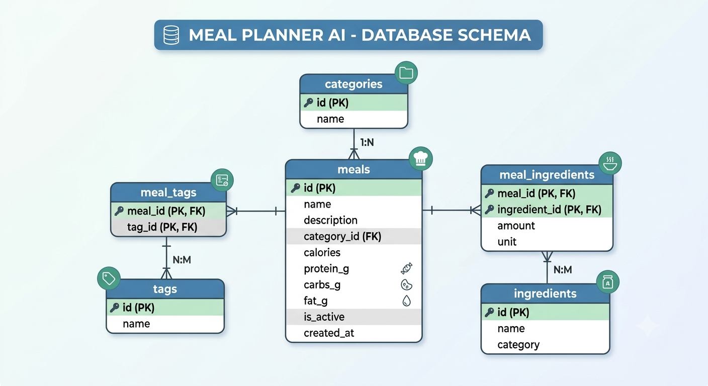

# Meal Planner AI 🥗🤖

Aplicación para la planificación semanal de comidas personalizada con asistente de Inteligencia Artificial y almacenamiento en PostgreSQL.

---

### 📐 Esquema de la Base de Datos

### 🔗 Relaciones y Estructura

* **`categories` (1:N con `meals`):** Clasifica los platos en *Desayuno, Almuerzo, Cena o Snack*.
* **`meals` (Tabla Principal):** Almacena información nutricional clave (calorías, proteínas, carbohidratos, grasas), tiempo de preparación y estado activo.
* **`tags` (N:M con `meals` mediante `meal_tags`):** Filtros y restricciones dietéticas (*Sin Gluten, Keto, Vegano, Alto en Proteína*, etc.).
* **`ingredients` (N:M con `meals` mediante `meal_ingredients`):** Catálogo de alimentos básicos que registra las cantidades (`amount`) y unidades (`unit`) exactas por plato para permitir la generación automática de la lista de la compra.

### 👁️ Vistas Especiales
* **`v_meals_full_info`:** Vista SQL unificada que concatena categorías, etiquetas e ingredientes formateados en una sola estructura optimizada para consultas de lenguaje natural con IA.